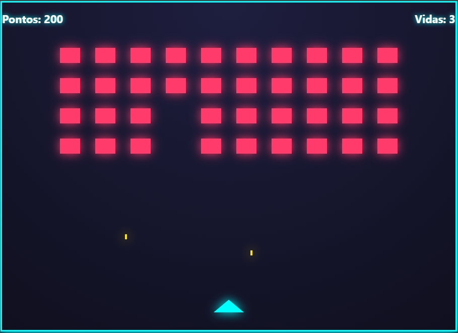

# 🚀 Neon Invaders

Neon Invaders é um projeto simples desenvolvido com **HTML, CSS e JavaScript**, criado com o objetivo de revisitar conceitos fundamentais da linguagem, especialmente manipulação de eventos e lógica de jogos.

O projeto é inspirado no clássico arcade **Space Invaders**, trazendo uma identidade visual neon e mecânicas básicas como movimentação, disparos, sistema de vidas e pontuação.

## 📸 Preview

## 🎮 Funcionalidades

- Movimentação da nave
- Sistema de disparos
- Inimigos em formação
- Contador de pontos
- Sistema de vidas
- Visual neon com efeitos de brilho

## 🛠️ Tecnologias Utilizadas

- HTML5
- CSS3
- JavaScript (Vanilla)

## 🎯 Objetivo

Este projeto foi desenvolvido como exercício prático para reforçar conceitos básicos de JavaScript, manipulação do DOM e eventos, sem a utilização de frameworks ou bibliotecas externas.
